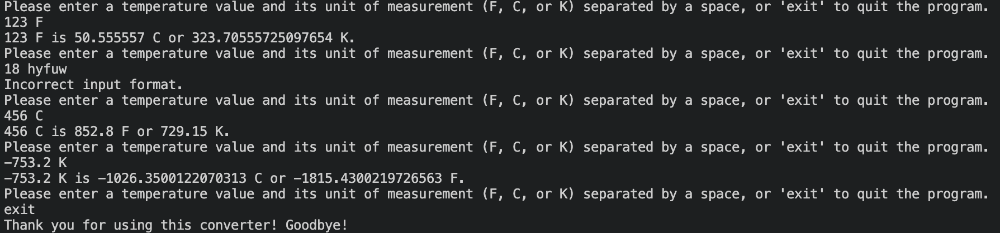

# Temperature Converter
A simple temperature converter made with C#.

[](https://docs.microsoft.com/en-us/dotnet/csharp/)
[](https://dotnet.microsoft.com/)


## Table of content

- [Features](#features)
- [Getting Started](#getting-started)
- [Project Structure](#project-structure)
- [Example Output](#example-output)
- [Credits](#credits)


## Features

- Prompts a user for a temperature value and its unit of measurement
- Uses regex to ensures that the input is in a correct format
- Displays incorrect message and continues prompting if it is not
- Handles negative temperatures as well as decimal numbers
- Converts to C, F, K based on user input (e.g., on C, it converts to F as well as K)
- Keeps running until user enters 'exit'


## Example Output




## Getting Started

1. Ensure that you have the [.NET SDK](https://dotnet.microsoft.com/download) installed.
2. Clone the reposutory and navigate to it.
3. Run `dotnet run`. The application will start running in the console.


## Project Structure

```
.
├── Program.cs
├── README.md
├── TemperatureConverter.csproj

```


## Credits

© Pavla Oubret 2023.